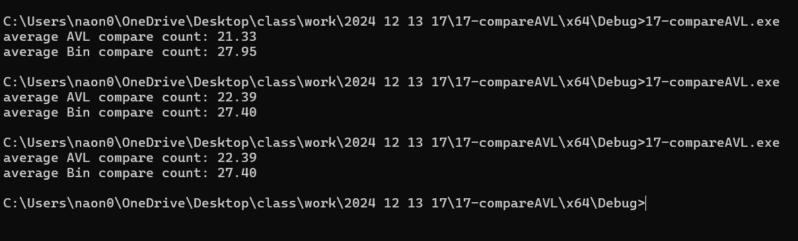

# compareAVL { Result Image }

이진 탐색 트리와 AVL에 대한 탐색의 비교횟수를 비교분석

AVL트리: 노드 삽입, 삭제, 탐색 시 트리의 균형 유지 위해 회전 수행
BST: 삽입 및 삭제 순서에 따라 구조 결정, 균형 조정 기능 X

두 트리에서 각각 2,000번의 연산(삽입, 삭제, 탐색)을 수행하여 비교

과정:
1 2,000개의 연산(삽입, 삭제, 탐색)을 각각의 트리에서 무작위로 실행
2 각 탐색 연산에 대해 비교 횟수를 누적 기록
3 탐색 작업의 평균 비교 횟수(총 비교 횟수 / 탐색 횟수)를 계산
4 결과를 출력하여 AVL 트리와 BST의 성능을 비교

compareCount: 연산 중 발생한 비교 횟수를 기록
searchCount: 탐색 연산 횟수를 기록

AVL: 삽입 및 삭제 과정에서 트리 균형 유지로 적은 비교 횟수 요구
BST: 삽입 순서에 따라 트리가 편향될 수 있기 때문에 비교 횟수 증가

장단점
AVL 트리
장점: 균형을 유지하므로 탐색 효율성이 높음
단점: 삽입 및 삭제 시 추가적인 회전 연산이 필요하여 연산 비용이 증가
BST
장점: 구조가 단순하며, 삽입 및 삭제 연산이 간단
단점: 데이터 입력 순서에 따라 성능이 크게 좌우됨

평균 비교 횟수 측면에서 AVL트리가 더 우수한 성능을 보입니다!
